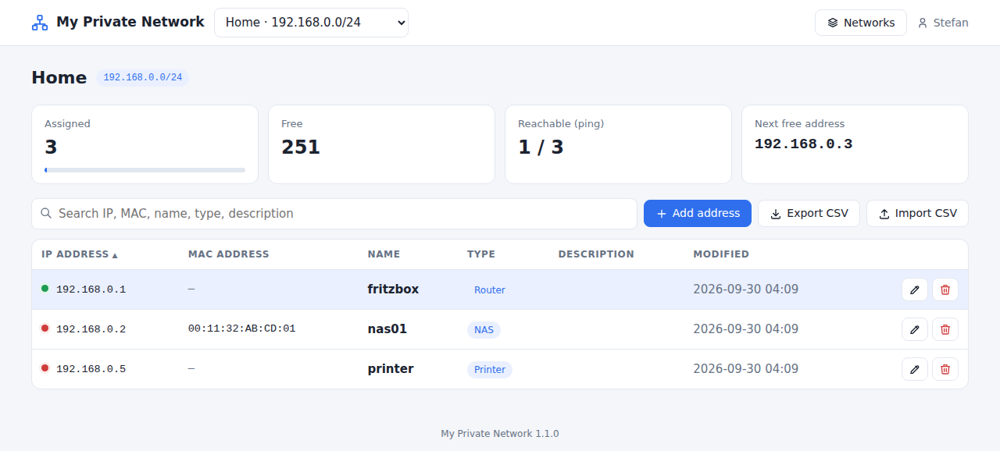

# My Private Network – Home Assistant App

A small IP address manager for your home network, as a Home Assistant app (formerly add-on) with sidebar integration via ingress. It also runs standalone on any Linux host with Python 3.9+.



## Installation in Home Assistant

[](https://my.home-assistant.io/redirect/supervisor_add_addon_repository/?repository_url=https%3A%2F%2Fgithub.com%2FBreitiDE%2Fha-my-private-network)

Or manually:

1. **Settings → Apps → App store**, menu (⋮) top right → **Repositories**
2. Add `https://github.com/BreitiDE/ha-my-private-network`
3. Install **My Private Network**, start it and enable **Show in sidebar**

The image is built on your Home Assistant host during installation (takes about a minute).

Supported architectures: `amd64`, `aarch64`.

## Features

- IP, MAC, name, type, description and last change per address
- Ping status dot per IP
- Multiple networks, search, sorting, next free address
- CSV import/export
- Login via Home Assistant (ingress), optional direct port with its own users and HTTPS
- All settings in the app configuration UI (English and German)

Details: [my_private_network/DOCS.md](my_private_network/DOCS.md)

## Standalone use (without Home Assistant)

`my_private_network/mpn.py` is a single Python file with no dependencies:

```bash
python3 mpn.py --set-password admin   # creates config.json and the first user
python3 mpn.py --gen-cert             # self-signed certificate (needs openssl)
python3 mpn.py                        # https://<host>:8443
```

A systemd unit and an install guide for Rocky Linux / RHEL are in [standalone/](standalone/).

## License

MIT, see [LICENSE](LICENSE).
